# ReviewsVerse
# 📝⚡ ReviewsVerse — UGC Reviews Platform & Real‑Time Data Pipelines (Case Study)

> **Note:** This repository is a **sanitized case study**. It documents the complete system (architecture, data flow, design decisions) with pseudocode and sample artifacts. Some production modules are not public; partial code and representative stubs may be included.

<p align="center">
  <a href="#overview">Overview</a> •
  <a href="#features">Features</a> •
  <a href="#architecture">Architecture</a> •
  <a href="#data-model--api">Data Model & API</a> •
  <a href="#streaming--etl">Streaming & ETL</a> •
  <a href="#data-quality--observability">Data Quality & Observability</a> •
  <a href="#ranking--spam-ml">Ranking & Spam (ML)</a> •
  <a href="#run-locally">Run Locally</a> •
  <a href="#roadmap">Roadmap</a>
</p>

---

## Overview

**ReviewsVerse** is a **user-generated reviews platform** built with a modern web stack and backed by robust streaming + ETL pipelines.

- **Frontend:** React
- **Backend:** Node.js / Express
- **Database:** MongoDB
- **Streaming & Storage:** Apache Kafka → AWS S3 (raw / curated)
- **ETL & Validation:** Apache Airflow + Great Expectations
- **Analytics/ML:** Batch aggregates, ranking model, spam detection

> **Highlights (beta):**
> - Handled **1,000+ active users** with **sub‑200ms** p50 API latency
> - **~30% lower data latency** via ETL optimizations
> - **~30% reduction** in pipeline failures after adding Great Expectations

---

## Features

- Reviews CRUD, ratings, comments, voting
- Real‑time event streaming via Kafka (write‑ahead for analytics & ML)
- Batch **aggregates** (product, category, time windows)
- **Data quality checks** & **schema validations**
- **Ranking signals** & **spam detection** integrated into ETL

---

## Architecture

### System Map (High‑Level)

```mermaid
flowchart LR
  %% Color classes
  classDef clients fill:#E3F2FD,stroke:#1E88E5,stroke-width:2px,color:#0D47A1;
  classDef services fill:#E8F5E9,stroke:#43A047,stroke-width:2px,color:#1B5E20;
  classDef streams fill:#FFF3E0,stroke:#FB8C00,stroke-width:2px,color:#E65100;
  classDef data fill:#F3E5F5,stroke:#8E24AA,stroke-width:2px,color:#4A148C;

  subgraph Clients
    W["Web App<br/>React"]
  end

  subgraph Services["Application Layer"]
    API["Node/Express API"]
    MDB["MongoDB<br/>OLTP"]
  end

  subgraph Streams["Streaming & Storage"]
    K["Kafka Topics<br/>events.reviews, events.activity"]
    S3["AWS S3<br/>raw/ • curated/"]
  end

  subgraph Data["Data Platform"]
    AF["Airflow DAGs<br/>Extract • Validate • Transform • Load"]
    GE["Great Expectations<br/>Data Validation"]
    AGG["Aggregates & Marts<br/>daily • hourly"]
    ML["Ranking & Spam Models"]
  end

  W -->|HTTPS| API
  API --> MDB
  API -->|Produce events| K
  K --> AF --> GE --> S3
  AF --> AGG
  AF --> ML
  W -->|analytics API| AGG

  %% Apply classes
  class W clients;
  class API,MDB services;
  class K,S3 streams;
  class AF,GE,AGG,ML data;
```



### Post Review → Analytics Flow (Sequence)


---

## Data Model & API

### MongoDB Collections (representative)

```json
// reviews
{
  "_id": "ObjectId",
  "productId": "string",
  "userId": "string",
  "rating": 1,
  "title": "string",
  "body": "string",
  "tags": ["string"],
  "createdAt": "ISODate",
  "updatedAt": "ISODate",
  "signals": { "helpfulVotes": 3, "reports": 0 }
}

// products
{
  "_id": "string",
  "name": "string",
  "category": "string",
  "avgRating": 4.3,
  "reviewCount": 1287,
  "updatedAt": "ISODate"
}
```

### Sample API Surface

```http
# Create a review
POST /api/v1/reviews
Content-Type: application/json
{
  "productId": "p-123",
  "rating": 5,
  "title": "Works great",
  "body": "Been using for a week...",
  "tags": ["durable","value"]
}

# Get reviews for a product
GET /api/v1/products/p-123/reviews?sort=recent&limit=20

# Product aggregates
GET /api/v1/products/p-123/aggregates
```

---

## Streaming & ETL

### Kafka Topics
- `events.reviews` (immutable create/update events)
- `events.activity` (votes, reports, clicks)

### Airflow DAG (pseudocode)

```python
with DAG("reviewsverse_pipeline", schedule_interval="*/10 * * * *", catchup=False) as dag:
    extract = KafkaToS3Operator(topic="events.reviews", s3_key="raw/reviews/{ds_nodash}.json")
    validate = GreatExpectationsOperator(checkpoint_name="reviews_raw_checkpoint")
    transform = SparkSubmitOperator(application="jobs/transform_reviews.py")
    aggregates = SparkSubmitOperator(application="jobs/build_aggregates.py")
    load = S3ToWarehouseOperator(source="curated/", table="reviews_curated")

    extract >> validate >> transform >> [aggregates, load]
```

---

## Data Quality & Observability

### Great Expectations (examples)
- **Schema:** required fields `productId`, `userId`, `rating`, `createdAt`
- **Ranges:** `rating` ∈ [1..5], title/body length bounds
- **Uniqueness:** idempotent keys for deduplication

```python
expect_column_values_to_not_be_null("productId")
expect_column_values_to_be_between("rating", 1, 5)
expect_table_row_count_to_be_between(min_value=1)
```

### Observability
- Structured logs, request IDs
- Metrics: API latency p50/p95, Kafka consumer lag, DAG task success rate
- Alerts on schema drift & expectation failures

---

## Ranking & Spam (ML)

**Signals:** recency, helpful votes, author history, length, sentiment, text quality  
**Spam:** supervised classifier (e.g., logistic regression / lightGBM) + heuristics  
**Ranking:** learning‑to‑rank baseline (pointwise) with textual features (TF‑IDF/embeddings)

```python
# spam classifier (pseudocode)
X = make_features(reviews_df)       # text + meta
y = labels_df["is_spam"]            # 0/1
clf = LogisticRegression(max_iter=1000).fit(X.train, y.train)
proba = clf.predict_proba(X.val)[:,1]
```

Models run in batch inside Airflow; outputs stored as features for the API.

---

## Run Locally

> This case‑study repo may include **partial code + stubs**; commands below illustrate a typical setup.

```bash
# API
cd api && npm install && npm run dev

# UI
cd web && npm install && npm start

# (Optional) Dev stack with Kafka & Mongo via docker‑compose
docker compose up -d
```
---

## Roadmap

- Near real‑time aggregates with incremental processing
- Online inference endpoint for ranking
- Advanced anomaly/spam detection with embeddings
- PII redaction in raw topics + retention policies

---